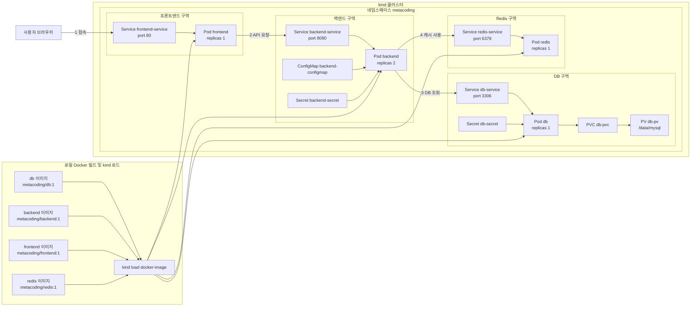
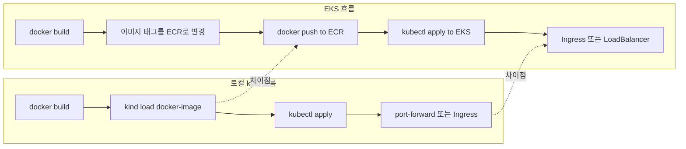
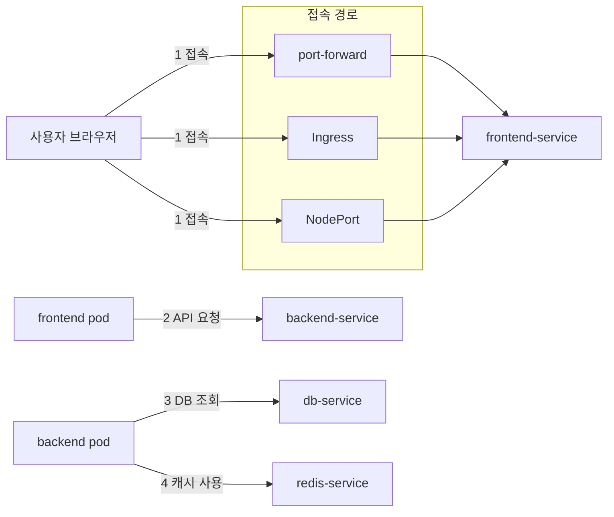
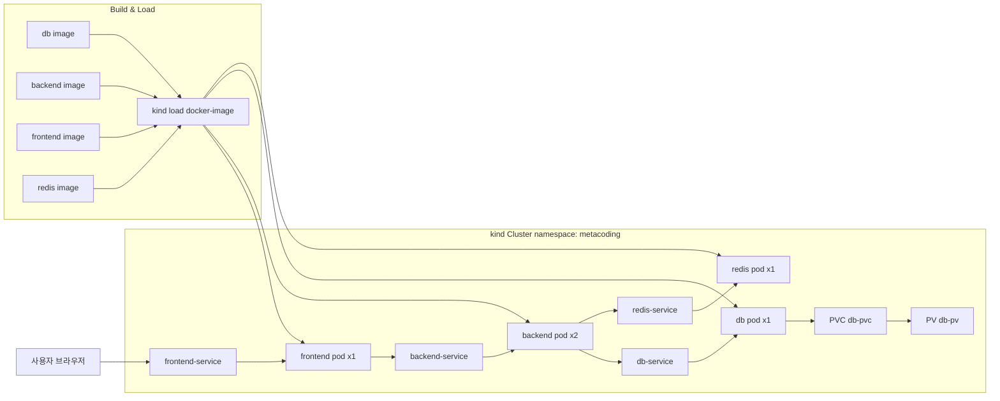

# kind + EKS 배포 가이드

이 폴더는 `ex08` 예제를 기반으로 **kind에서 검증한 뒤 EKS에 업로드/배포**할 수 있도록 정리한 버전입니다.

## 폴더 구조

- `backend/` 백엔드 이미지 소스
- `frontend/` 프론트엔드 이미지 소스
- `db/` DB 이미지 소스
- `redis/` Redis 이미지 소스
- `k8s/` 쿠버네티스 매니페스트

## 실행 방법: kind

### Windows 사전 준비

- Docker Desktop 설치 및 WSL2 활성화 (Backend가 WSL2인지 확인)
- kind, kubectl 설치
  - winget: `winget install Kubernetes.kind` / `winget install Kubernetes.kubectl`
  - choco: `choco install kind kubernetes-cli`
- 설치 확인
  - `kind version`
  - `kubectl version --client`

### macOS 사전 준비

- Docker Desktop 설치
- kind, kubectl 설치
  - Homebrew: `brew install kind kubectl`
- 설치 확인
  - `kind version`
  - `kubectl version --client`

### Ingress 사용 (선택)

- Ingress를 쓸 경우, 아래 설정으로 클러스터를 생성해야 합니다 (host 80/443 포트 매핑)
  - 예: `kind-cluster.yml`
    ```yaml
    kind: Cluster
    apiVersion: kind.x-k8s.io/v1alpha4
    nodes:
      - role: control-plane
        extraPortMappings:
          - containerPort: 80
            hostPort: 80
            protocol: TCP
          - containerPort: 443
            hostPort: 443
            protocol: TCP
    ```
- 클러스터 생성 (기본 생성 명령 대신 사용)
  - `kind create cluster --name metacoding --config kind-cluster.yml`
- ingress-nginx 설치
  - `kubectl apply -f https://raw.githubusercontent.com/kubernetes/ingress-nginx/main/deploy/static/provider/kind/deploy.yaml`
- Ingress 리소스 적용
  - `kubectl apply -f k8s/ingress/ingress.yml`
- Ingress 경로
  - `/` -> `frontend-service`
  - `/api` -> `backend-service`

1. kind 클러스터 생성 (둘 중 하나만 선택)
   - 기본(포트 매핑 없음): `kind create cluster --name metacoding`
   - Ingress 사용(80/443 매핑): `kind create cluster --name metacoding --config kind-cluster.yml`
2. 로컬 Docker 이미지 빌드
   - `docker build -t metacoding/db:1 ./db`
   - `docker build -t metacoding/backend:1 ./backend`
   - `docker build -t metacoding/frontend:1 ./frontend`
   - `docker build -t metacoding/redis:1 ./redis`
3. kind 노드로 이미지 로드
   - `kind load docker-image metacoding/db:1 --name metacoding`
   - `kind load docker-image metacoding/backend:1 --name metacoding`
   - `kind load docker-image metacoding/frontend:1 --name metacoding`
   - `kind load docker-image metacoding/redis:1 --name metacoding`
4. 네임스페이스 및 리소스 적용
   - `kubectl apply -f k8s/namespace.yml`
   - `kubectl apply -f k8s/ --recursive`
5. 접속
   - `kubectl port-forward service/frontend-service 8080:80 -n metacoding`
   - 브라우저에서 `http://localhost:8080` 접속
   - Ingress 사용 시 `http://localhost` 접속 (80 포트 매핑 기준)
   - API 확인: `http://localhost/api`

## EKS 업로드 및 배포 방법

### 1. ECR 리포지토리 준비

- 서비스별로 ECR 리포지토리를 생성합니다.
  - 예: `metacoding-db`, `metacoding-backend`, `metacoding-frontend`, `metacoding-redis`

### 2. 이미지 태그 변경 및 푸시

1. AWS ECR 로그인
   - `aws ecr get-login-password --region <REGION> | docker login --username AWS --password-stdin <ACCOUNT_ID>.dkr.ecr.<REGION>.amazonaws.com`
2. 이미지 태그 변경
   - `docker tag metacoding/db:1 <ACCOUNT_ID>.dkr.ecr.<REGION>.amazonaws.com/metacoding-db:1`
   - `docker tag metacoding/backend:1 <ACCOUNT_ID>.dkr.ecr.<REGION>.amazonaws.com/metacoding-backend:1`
   - `docker tag metacoding/frontend:1 <ACCOUNT_ID>.dkr.ecr.<REGION>.amazonaws.com/metacoding-frontend:1`
   - `docker tag metacoding/redis:1 <ACCOUNT_ID>.dkr.ecr.<REGION>.amazonaws.com/metacoding-redis:1`
3. 이미지 푸시
   - `docker push <ACCOUNT_ID>.dkr.ecr.<REGION>.amazonaws.com/metacoding-db:1`
   - `docker push <ACCOUNT_ID>.dkr.ecr.<REGION>.amazonaws.com/metacoding-backend:1`
   - `docker push <ACCOUNT_ID>.dkr.ecr.<REGION>.amazonaws.com/metacoding-frontend:1`
   - `docker push <ACCOUNT_ID>.dkr.ecr.<REGION>.amazonaws.com/metacoding-redis:1`

### 3. EKS 클러스터에 배포

1. EKS 클러스터와 kubeconfig 준비
   - `aws eks update-kubeconfig --name <EKS_CLUSTER_NAME> --region <REGION>`
2. `k8s/` 매니페스트의 이미지 경로를 ECR로 변경
   - 예: `metacoding/backend:1` -> `<ACCOUNT_ID>.dkr.ecr.<REGION>.amazonaws.com/metacoding-backend:1`
3. 리소스 적용
   - `kubectl apply -f k8s/namespace.yml`
   - `kubectl apply -f k8s/ --recursive`

## 주의 사항

- kind는 로컬 노드 컨테이너에 이미지를 로드해야 합니다.
- EKS는 이미지가 ECR에 있어야 하며, 이미지 경로를 반드시 ECR로 변경해야 합니다.
- PV의 `hostPath`는 EKS에서 권장되지 않습니다. 실제 EKS에서는 EBS 기반 스토리지 클래스를 사용하는 것이 일반적입니다.
- 서비스 노출은 EKS에서 Ingress나 LoadBalancer로 변경하는 것이 일반적입니다.
- Ingress는 컨트롤러 설치가 필요합니다. kind는 ingress-nginx, EKS는 ALB/NGINX 중 선택해서 구성하세요.

## 아키텍처 구성: kind



## 배포 흐름 비교: kind -> EKS



## 서비스 접속 흐름 상세



## kind 배포 흐름 (flow)


