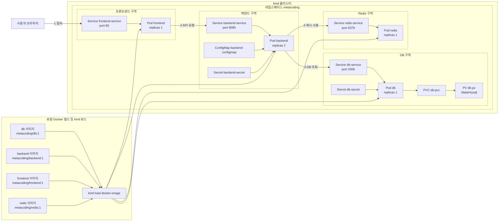
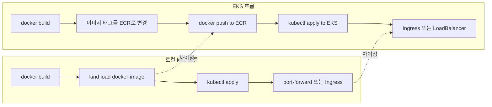
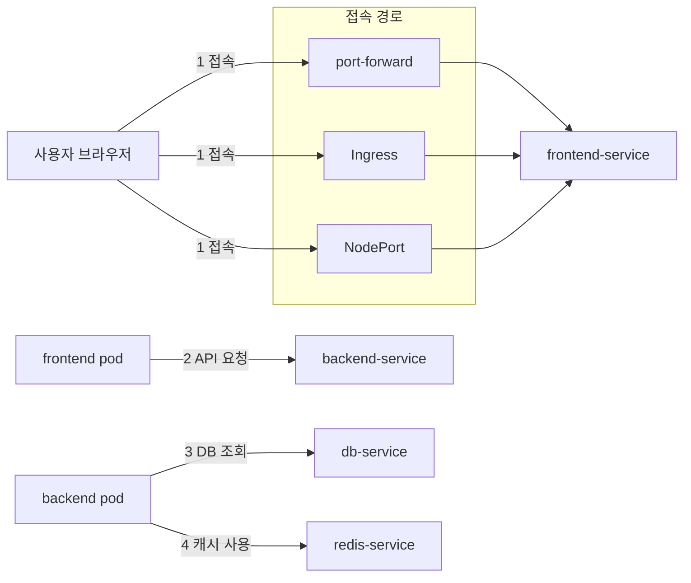
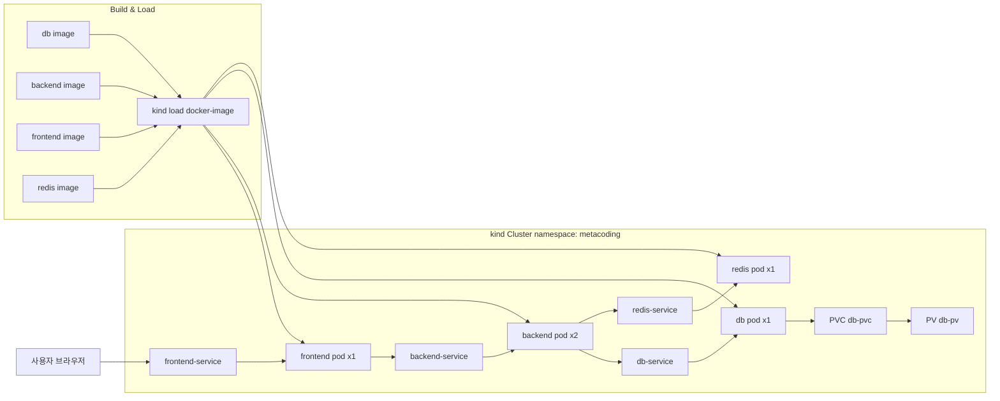

# kind + EKS 배포 가이드

이 폴더는 `ex08` 예제를 기반으로 **kind에서 검증한 뒤 EKS에 업로드/배포**할 수 있도록 정리한 버전입니다.

## 폴더 구조

- `backend/` 백엔드 이미지 소스
- `frontend/` 프론트엔드 이미지 소스
- `db/` DB 이미지 소스
- `redis/` Redis 이미지 소스
- `k8s/` 쿠버네티스 매니페스트

## 실행 방법: kind

### Windows 사전 준비

- Docker Desktop 설치 및 WSL2 활성화 (Backend가 WSL2인지 확인)
- kind, kubectl 설치
  - winget: `winget install Kubernetes.kind` / `winget install Kubernetes.kubectl`
  - choco: `choco install kind kubernetes-cli`
- 설치 확인
  - `kind version`
  - `kubectl version --client`

### macOS 사전 준비

- Docker Desktop 설치
- kind, kubectl 설치
  - Homebrew: `brew install kind kubectl`
- 설치 확인
  - `kind version`
  - `kubectl version --client`

### Ingress 사용 (선택)

- Ingress를 쓸 경우, 아래 설정으로 클러스터를 생성해야 합니다 (host 80/443 포트 매핑)
  - 예: `kind-cluster.yml`
    ```yaml
    kind: Cluster
    apiVersion: kind.x-k8s.io/v1alpha4
    nodes:
      - role: control-plane
        extraPortMappings:
          - containerPort: 80
            hostPort: 80
            protocol: TCP
          - containerPort: 443
            hostPort: 443
            protocol: TCP
    ```
### kind 실습
- 클러스터 생성 (기본 생성 명령 대신 사용)
  - `kind create cluster --name metacoding --config kind-cluster.yml`
- ingress-nginx 설치
  - `kubectl apply -f https://raw.githubusercontent.com/kubernetes/ingress-nginx/main/deploy/static/provider/kind/deploy.yaml`
- Ingress 리소스 적용
  - `kubectl apply -f k8s/ingress/ingress.yml`
- Ingress 경로
  - `/` -> `frontend-service`
  - `/api` -> `backend-service`

1. kind 클러스터 생성 (둘 중 하나만 선택)
   - 기본(포트 매핑 없음): `kind create cluster --name metacoding`
   - Ingress 사용(80/443 매핑): `kind create cluster --name metacoding --config kind-cluster.yml`
2. 로컬 Docker 이미지 빌드
   - `docker build -t metacoding/db:1 ./db`
   - `docker build -t metacoding/backend:1 ./backend`
   - `docker build -t metacoding/frontend:1 ./frontend`
   - `docker build -t metacoding/redis:1 ./redis`
3. kind 노드로 이미지 로드
   - `kind load docker-image metacoding/db:1 --name metacoding`
   - `kind load docker-image metacoding/backend:1 --name metacoding`
   - `kind load docker-image metacoding/frontend:1 --name metacoding`
   - `kind load docker-image metacoding/redis:1 --name metacoding`
4. 네임스페이스 및 리소스 적용
   - kind에서는 `k8s/backend/backend-configmap.yml`의 DB URL을 `db-service`로 맞춰주세요.
     - 예: `jdbc:mysql://db-service:3306/metadb?...`
   - `kubectl apply -f k8s/namespace.yml`
   - `kubectl apply -f k8s/ --recursive`
5. 접속
   - `kubectl port-forward service/frontend-service 8080:80 -n metacoding`
   - 브라우저에서 `http://localhost:8080` 접속
   - Ingress 사용 시 `http://localhost` 접속 (80 포트 매핑 기준)
   - API 확인: `http://localhost/api`

## EKS 업로드 및 배포 방법

### 1. ECR 리포지토리 준비

- 서비스별로 ECR 리포지토리를 생성합니다.
  - 예: `metacoding-db`, `metacoding-backend`, `metacoding-frontend`, `metacoding-redis`

### 2. 이미지 태그 변경 및 푸시

1. AWS ECR 로그인
   - `aws ecr get-login-password --region ap-northeast-2 | docker login --username AWS --password-stdin 842903729788.dkr.ecr.ap-northeast-2.amazonaws.com`
2. 이미지 태그 변경
   - `docker tag metacoding/db:1 842903729788.dkr.ecr.ap-northeast-2.amazonaws.com/metacoding-db:1`
   - `docker tag metacoding/backend:1 842903729788.dkr.ecr.ap-northeast-2.amazonaws.com/metacoding-backend:1`
   - `docker tag metacoding/frontend:1 842903729788.dkr.ecr.ap-northeast-2.amazonaws.com/metacoding-frontend:1`
   - `docker tag metacoding/redis:1 842903729788.dkr.ecr.ap-northeast-2.amazonaws.com/metacoding-redis:1`
3. 이미지 푸시
   - `docker push 842903729788.dkr.ecr.ap-northeast-2.amazonaws.com/metacoding-db:1`
   - `docker push 842903729788.dkr.ecr.ap-northeast-2.amazonaws.com/metacoding-backend:1`
   - `docker push 842903729788.dkr.ecr.ap-northeast-2.amazonaws.com/metacoding-frontend:1`
   - `docker push 842903729788.dkr.ecr.ap-northeast-2.amazonaws.com/metacoding-redis:1`

### 3. EKS 클러스터에 배포

1. EKS 클러스터와 kubeconfig 준비
   - `aws eks update-kubeconfig --name metacoding --region ap-northeast-2`
2. `k8s/` 매니페스트의 이미지 경로를 ECR로 변경
   - 예: `metacoding/backend:1` -> `842903729788.dkr.ecr.ap-northeast-2.amazonaws.com/metacoding-backend:1`
3. 리소스 적용
   - `kubectl apply -f k8s/namespace.yml`
   - DB를 **클러스터 내부에 둘 때만** `k8s/db`를 적용합니다.
   - RDS 사용 시 (권장):
     - `kubectl apply -f k8s/backend/`
     - `kubectl apply -f k8s/frontend/`
     - `kubectl apply -f k8s/redis/`
     - `kubectl apply -f k8s/ingress/` (Ingress 사용 시)
   - 클러스터 내부 DB 사용 시:
     - `kubectl apply -f k8s/ --recursive`

### 3-1. RDS 사용으로 전환 (권장)

1. RDS MySQL 생성
   - EKS와 **같은 VPC/Subnet**에 생성
   - 보안 그룹 인바운드에 `3306` 허용 (EKS 노드/클러스터 보안 그룹에서 접근 가능하도록)
2. 백엔드 DB 접속 정보 설정
   - `k8s/backend/backend-configmap.yml`의 `SPRING_DATASOURCE_URL`을 RDS 엔드포인트로 변경
     - 예: `jdbc:mysql://YOUR_RDS_ENDPOINT:3306/metadb?useSSL=false&serverTimezone=UTC&useLegacyDatetimeCode=false&allowPublicKeyRetrieval=true`
   - `k8s/backend/backend-secret.yml`의 `SPRING_DATASOURCE_USERNAME / SPRING_DATASOURCE_PASSWORD`를 RDS 계정으로 변경
3. 클러스터에 적용
   - `kubectl apply -f k8s/namespace.yml`
   - `kubectl apply -f k8s/backend/`
   - `kubectl apply -f k8s/frontend/`
   - `kubectl apply -f k8s/redis/`
   - `kubectl apply -f k8s/ingress/` (Ingress 사용 시)
4. (이미 DB 리소스를 적용했다면) 내부 DB 삭제
   - `kubectl delete -f k8s/db/ --recursive`

### 4. Service LoadBalancer로 외부 접속 (프론트 단일 노출)

Ingress 없이 프론트 서비스만 외부로 노출하려면 Service 타입을 LoadBalancer로 적용합니다.

1. LoadBalancer 서비스 적용
   - `kubectl apply -f k8s/frontend/frontend-service-loadbalancer.yml`
2. 외부 주소 확인
   - `kubectl get svc -n metacoding`
   - `EXTERNAL-IP`가 할당되면 해당 주소로 접속

#### (옵션) NLB로 고정하기

EKS에서 Classic 대신 **NLB**로 고정하고 싶다면 `frontend-service-loadbalancer.yml`에 아래 애노테이션을 추가합니다.

```yaml
metadata:
  annotations:
    service.beta.kubernetes.io/aws-load-balancer-type: "nlb"
    service.beta.kubernetes.io/aws-load-balancer-scheme: "internet-facing"
```

#### (옵션) CLB(Classic)로 유지하기

`frontend-service-loadbalancer.yml`처럼 **`aws-load-balancer-type` 애노테이션을 넣지 않으면** 기본 동작(레거시 AWS 클라우드 프로바이더)에서 Classic Load Balancer가 생성됩니다.  
AWS Load Balancer Controller를 사용 중이라면 `aws-load-balancer-type: external` 또는 `nlb-ip`를 지정하지 않아야 CLB가 생성됩니다.

> 참고: `/api`까지 같은 도메인에서 라우팅하려면 LoadBalancer 대신 ALB Ingress가 더 적합합니다.

### (선택) 일회용 환경변수로 자격증명 주입

로컬에 저장하지 않고 현재 PowerShell 세션에만 적용하고 싶다면 아래처럼 사용합니다.

```powershell
# 환경변수 설정 (현재 세션에만 유효)
$env:AWS_ACCESS_KEY_ID="YOUR_ACCESS_KEY_ID"
$env:AWS_SECRET_ACCESS_KEY="YOUR_SECRET_ACCESS_KEY"
$env:AWS_DEFAULT_REGION="ap-northeast-2"

# kubeconfig 갱신
python -m awscli eks update-kubeconfig --name metacoding --region ap-northeast-2
```

`aws-env.example.ps1` 파일을 만들어 두었다면 다음처럼 실행할 수 있습니다.

```powershell
powershell -ExecutionPolicy Bypass -File aws-env.example.ps1
python -m awscli eks update-kubeconfig --name metacoding --region ap-northeast-2
```

### (선택) 브라우저에서 리소스 적용하기

- **EKS 콘솔**은 기본적으로 클러스터 리소스를 **조회**하는 용도입니다.
- 브라우저에서 **YAML 업로드/적용**이 필요하면 **Kubernetes Dashboard** 같은 웹 UI를 설치해서 사용합니다.

## 주의 사항

- kind는 로컬 노드 컨테이너에 이미지를 로드해야 합니다.
- EKS는 이미지가 ECR에 있어야 하며, 이미지 경로를 반드시 ECR로 변경해야 합니다.
- PV의 `hostPath`는 EKS에서 권장되지 않습니다. 실제 EKS에서는 EBS 기반 스토리지 클래스를 사용하거나 **RDS로 분리**하는 것이 일반적입니다.
- 서비스 노출은 EKS에서 Ingress나 LoadBalancer로 변경하는 것이 일반적입니다.
- Ingress는 컨트롤러 설치가 필요합니다. kind는 ingress-nginx, EKS는 ALB/NGINX 중 선택해서 구성하세요.

## 실습 자료: EKS + RDS (UI/CLI 단계별)

처음부터 다시 해도 성공하도록 UI/CLI 단계와 명령어 설명을 정리한 실습 자료입니다.  
머메이드 다이어그램 포함.

- `docs/eks-rds-lab.md`

## Service 노출 방식 비교: LoadBalancer vs ALB Ingress

### 요약
- **LoadBalancer(Service 타입)**: 가장 빠르게 외부 접속을 열고 싶을 때
- **ALB Ingress**: 도메인/경로 기반 라우팅과 운영 편의성을 원할 때

### 차이점 (개발자 관점)
| 항목 | Service LoadBalancer | ALB Ingress |
| --- | --- | --- |
| 적용 난이도 | 매우 쉬움 (Service 타입 변경) | 중간 (컨트롤러 설치 + Ingress 리소스) |
| 라우팅 | 서비스 단위 | 경로/호스트 기반 라우팅 가능 |
| 비용/리소스 | 서비스마다 LB 생성 (비용 증가 가능) | 하나의 ALB로 여러 서비스 라우팅 가능 |
| 운영 편의 | 단순하지만 확장 시 LB 증가 | 정책/라우팅 관리가 유연 |
| TLS/도메인 | 별도 설정 필요 | Ingress에서 통합 관리 용이 |

### AWS Load Balancer 종류 차이 (CLB/NLB/ALB)
| 항목 | CLB (Classic) | NLB (Network) | ALB (Application) |
| --- | --- | --- | --- |
| 계층 | L4/L7 혼합(구형) | L4 | L7 |
| 주요 용도 | 레거시/간단한 L4/L7 | 고성능 TCP/UDP 분산 | HTTP/HTTPS 라우팅, 경로/호스트 |
| 라우팅 기능 | 제한적 | 없음 (L4) | 풍부(경로/호스트/리다이렉트) |
| 권장 여부 | 신규 권장 X | 고성능 L4 필요 시 | 웹/API 서비스 표준 |
| 대표 기능 | 기본적인 헬스체크 | 고정 IP, 초고성능 | TLS 종료, WAF, 규칙 기반 라우팅 |

### 선택 가이드 (가중치 예시)
- **빠른 데모/학습 (7점)**: LoadBalancer
- **마이크로서비스 확장성 (8점)**: ALB Ingress
- **운영 단순성 (6점)**: LoadBalancer
- **비용 효율 (7점)**: ALB Ingress
- **도메인/HTTPS 운영 (8점)**: ALB Ingress

### 언제 쓰나
- **LoadBalancer**: 단일 서비스, 빠른 검증, 운영 복잡도 최소화가 목표일 때
- **ALB Ingress**: 여러 서비스/경로 통합, 도메인/TLS 관리, 실서비스 운영 시

## 아키텍처 구성: kind



## 배포 흐름 비교: kind -> EKS



## 서비스 접속 흐름 상세



## kind 배포 흐름 (flow)


