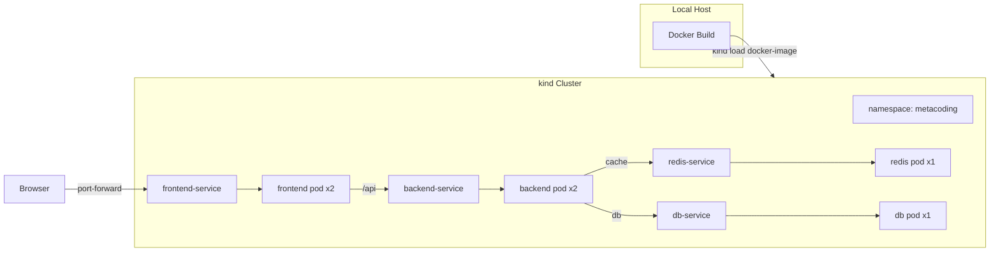
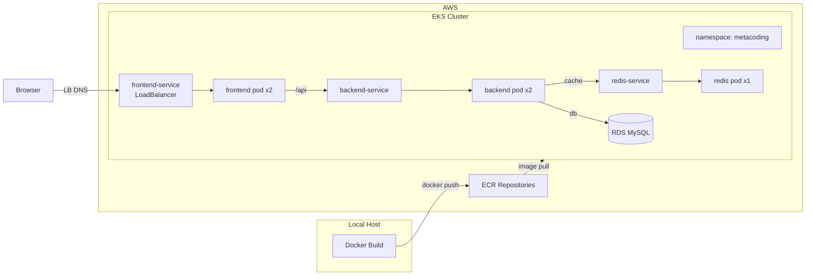

# 전체 구조 (Mermaid)

아래는 **로컬(kind)** 과 **EKS** 환경의 전체 구조를 구분해서 정리한 Mermaid 다이어그램입니다.

---

## 1) 로컬 (kind)

```mermaid
flowchart LR
  subgraph Local[Local Host]
    Docker[Docker Build]
  end

  subgraph KindCluster[kind Cluster]
    NS[namespace: metacoding]

    FE[frontend pod x2]
    BE[backend pod x2]
    RD[redis pod x1]
    DB[db pod x1]

    FE_SVC[frontend-service]
    BE_SVC[backend-service]
    RD_SVC[redis-service]
    DB_SVC[db-service]

    FE_SVC --> FE
    BE_SVC --> BE
    RD_SVC --> RD
    DB_SVC --> DB

    FE -->|/api| BE_SVC
    BE -->|cache| RD_SVC
    BE -->|db| DB_SVC
  end

  Docker -->|kind load docker-image| KindCluster
  User[Browser] -->|port-forward| FE_SVC
```

---

## 2) EKS (RDS + LoadBalancer)

```mermaid
flowchart LR
  subgraph Local[Local Host]
    Build[Docker Build]
  end

  subgraph AWS[AWS]
    ECR[ECR Repositories]
    RDS[(RDS MySQL)]

    subgraph EKSCluster[EKS Cluster]
      NS[namespace: metacoding]

      FE[frontend pod x2]
      BE[backend pod x2]
      RD[redis pod x1]

      FE_SVC[frontend-service\nLoadBalancer]
      BE_SVC[backend-service]
      RD_SVC[redis-service]

      FE_SVC --> FE
      BE_SVC --> BE
      RD_SVC --> RD

      FE -->|/api| BE_SVC
      BE -->|cache| RD_SVC
      BE -->|db| RDS
    end
  end

  Build -->|docker push| ECR
  ECR -->|image pull| EKSCluster
  User[Browser] -->|LB DNS| FE_SVC
```
