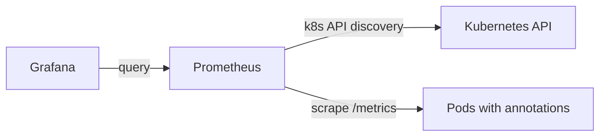

# Monitoring (Prometheus + Grafana) 문서

이 문서는 본 프로젝트의 **monitoring/** 매니페스트 구조와 개념, 용도, 특성을 정리한 실습/운영용 요약입니다.  
Helm 없이 **Manifest만으로 최소 구성을 이해**하는 것이 목표입니다.

---

## 1) 용도

- **Prometheus**: 클러스터/파드 메트릭 수집 및 저장
- **Grafana**: Prometheus 데이터를 시각화(대시보드)
- **목표**: 모니터링의 역할과 연결 관계를 최소 구성으로 이해

---

## 2) 구조 (monitoring/)

```
monitoring/
├─ namespace.yaml
│  └─ 모니터링 전용 네임스페이스
│
├─ prometheus/
│  ├─ rbac.yaml
│  │  └─ Prometheus 읽기 전용 권한(RBAC)
│  ├─ configmap.yaml
│  │  └─ prometheus.yml (스크레이프 규칙)
│  ├─ deployment.yaml
│  │  └─ Prometheus 서버 파드
│  └─ service.yaml
│     └─ Prometheus 서비스
│
└─ grafana/
   ├─ datasource-configmap.yaml
   │  └─ Prometheus 데이터소스 자동 등록
   ├─ deployment.yaml
   │  └─ Grafana 서버 파드
   └─ service.yaml
      └─ Grafana 서비스
```

---

## 3) 구성 요소 개념 정리

### Prometheus
- **역할**: 메트릭 수집/저장
- **특성**
  - pull 방식 (Prometheus가 대상에 직접 /metrics 요청)
  - 기본 저장소는 컨테이너 내부 (PVC 없음 → 재시작 시 데이터 소실)
  - ServiceMonitor 등 CRD 미사용 (기본 동작 이해 목적)

### Grafana
- **역할**: 메트릭 시각화
- **특성**
  - 데이터소스는 ConfigMap으로 자동 등록
  - 대시보드 자동 로딩 없음 (최소 구성)

---

## 4) Prometheus 스크레이프 정책

`monitoring/prometheus/configmap.yaml`의 핵심:

- **Nodes**: `role: node` 로 자동 발견
- **Pods**: `prometheus.io/scrape: "true"` 어노테이션이 있는 파드만 수집

예시 (파드에 어노테이션 추가):
```yaml
metadata:
  annotations:
    prometheus.io/scrape: "true"
```

---

## 5) 구성 요소 상세 용도

### namespace.yaml
- 모니터링 리소스를 앱 네임스페이스와 분리하기 위한 **경계**

### prometheus/rbac.yaml
- Prometheus ServiceAccount 생성
- 클러스터 조회 권한만 부여 (get/list/watch)
- **쓰기 권한 없음 → 안전**

### prometheus/configmap.yaml
- Prometheus 설정 파일(prometheus.yml) 저장
- 스크레이프 주기 및 대상 정의

### prometheus/deployment.yaml
- Prometheus 서버 파드 실행
- 단일 인스턴스(실습용)

### prometheus/service.yaml
- Prometheus 접근용 Service
- Grafana 또는 port-forward 접근에 사용

### grafana/datasource-configmap.yaml
- Grafana 시작 시 Prometheus 데이터소스를 자동 등록

### grafana/deployment.yaml
- Grafana 서버 파드 실행
- 인증/대시보드 자동 로딩 생략

### grafana/service.yaml
- Grafana 접근용 Service

---

## 6) 적용/접속 방법

```powershell
kubectl apply -f monitoring/namespace.yaml
# monitoring 네임스페이스 생성

kubectl apply -f monitoring/prometheus/
# Prometheus 리소스 적용

kubectl apply -f monitoring/grafana/
# Grafana 리소스 적용
```

---

## 6-1) 스크레이프 대상 파드 반영 (backend)

Prometheus 어노테이션을 추가한 뒤에는 **백엔드 배포를 재적용/재시작**해야 합니다.

```powershell
kubectl apply -f k8s/backend/backend-deploy.yml
# 백엔드 Deployment에 어노테이션을 반영합니다.

kubectl rollout restart deployment/backend-deploy -n metacoding
# 백엔드 파드를 재시작하여 변경사항을 적용합니다.
```

Port-forward:
```powershell
kubectl port-forward svc/prometheus -n monitoring 9090:9090
# Prometheus UI 접속 (http://localhost:9090)

kubectl port-forward svc/grafana -n monitoring 3000:3000
# Grafana UI 접속 (http://localhost:3000)
```

Grafana 기본 로그인:
- ID: `admin`
- PW: `admin`

---

## 7) 특성/제한 (실습 기준)

- **저장소 없음**: Prometheus/Grafana 모두 PVC 미사용
- **대시보드 자동 로딩 없음**
- **Ingress 없음**: port-forward 전제
- **모니터링 대상 최소화**: annotation 있는 파드만 수집

---

## 8) 확장 아이디어

- Prometheus PVC 추가 (장기 보관)
- Grafana 대시보드 JSON 자동 로딩
- Alertmanager 추가
- Ingress 또는 LoadBalancer로 외부 노출
- EKS Managed Prometheus로 전환

---

## 9) Mermaid 흐름도


