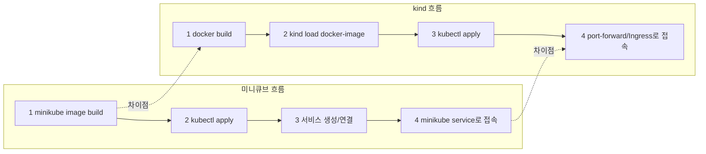
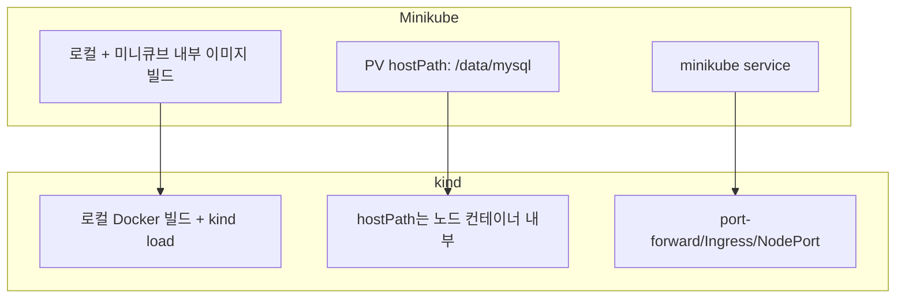
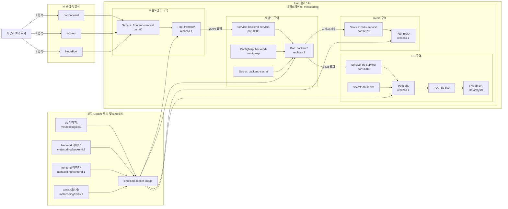
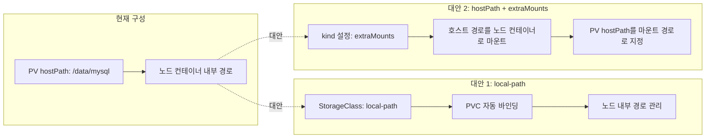

# 미니큐브 -> kind 변경 방법 및 비교

이 문서는 현재 프로젝트를 미니큐브에서 kind로 변경하는 방법, 주의 사항, 그리고 흐름 비교를 정리합니다.

## 변경 방법 (요약)

1. kind 클러스터 생성
   - 예: `kind create cluster --name metacoding`
2. 이미지 준비 방식 변경
   - 미니큐브: `minikube image build ...`
   - kind: 로컬 Docker에서 빌드 후 `kind load docker-image ...`
3. 네임스페이스/리소스 적용
   - 동일하게 `kubectl apply -f k8s/ --recursive`
4. 접속 방식 변경
   - 미니큐브: `minikube service frontend-service -n metacoding --url`
   - kind: `kubectl port-forward` 또는 Ingress/NodePort 설정

## 주의 사항

- 이미지 로딩 방식 차이
  - kind는 노드가 별도 컨테이너이므로 로컬 이미지를 자동으로 보지 않습니다.
  - 반드시 `kind load docker-image metacoding/backend:1` 처럼 노드에 로드해야 합니다.
- PV/HostPath 경로
  - 현재 PV는 `hostPath: /data/mysql`로 설정되어 있습니다.
  - kind 노드는 컨테이너이므로 실제 노드 파일시스템과 다릅니다.
  - 데이터 보존/공유가 필요하면 hostPath 대신 local-path/스토리지클래스 고려.
- Service 접근
  - kind는 `minikube service` 명령이 없습니다.
  - `kubectl port-forward service/frontend-service 8080:80 -n metacoding` 같은 방식 필요.
- NodePort 사용 시 포트 충돌 주의
  - 로컬 개발 환경에서 기존 포트와 충돌할 수 있습니다.
- 이미지 태그 고정
  - `:latest` 대신 버전 태그를 사용해 로딩 혼동을 줄이는 것이 안전합니다.

## 명령어 예시

```bash
# 1) kind 클러스터 생성
kind create cluster --name metacoding

# 2) 로컬 Docker에서 이미지 빌드
docker build -t metacoding/db:1 ./db
docker build -t metacoding/backend:1 ./backend
docker build -t metacoding/frontend:1 ./frontend
docker build -t metacoding/redis:1 ./redis

# 3) kind 노드로 이미지 로드
kind load docker-image metacoding/db:1 --name metacoding
kind load docker-image metacoding/backend:1 --name metacoding
kind load docker-image metacoding/frontend:1 --name metacoding
kind load docker-image metacoding/redis:1 --name metacoding

# 4) 리소스 적용
kubectl apply -f k8s/namespace.yml
kubectl apply -f k8s/ --recursive

# 5) 접속 (포트포워딩 예시)
kubectl port-forward service/frontend-service 8080:80 -n metacoding
```

## 흐름 비교 (미니큐브 vs kind)



## 구성 리소스 관점 비교



## kind 아키텍처 (LR)

아래는 `minikube-architecture.md` 구성을 kind 기준으로 바꾼 LR 플로우차트입니다.



## PV 대안 흐름 (kind 기준)

kind에서 `hostPath` 대신 사용할 수 있는 대안을 간단히 비교합니다.


