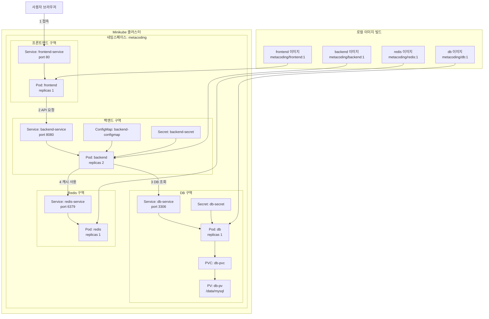

# 미니큐브 빌드 결과 아키텍처

아래 플로우차트는 이 프로젝트를 미니큐브에서 빌드/배포했을 때 생성되는 리소스와, 사용자 접속 시 흐름을 구역별로 묶어 보여줍니다.

```mermaid

flowchart TD
  %% 로컬 빌드 단계
  subgraph Build[로컬 이미지 빌드]
    b_db[db 이미지<br>metacoding/db:1]
    b_be[backend 이미지<br>metacoding/backend:1]
    b_fe[frontend 이미지<br>metacoding/frontend:1]
    b_redis[redis 이미지<br>metacoding/redis:1]
  end

  %% 클러스터/네임스페이스
  subgraph Cluster[Minikube 클러스터]
    subgraph NS[네임스페이스: metacoding]
      subgraph FE[프론트엔드 구역]
        fe_svc[Service: frontend-service<br>port 80]
        fe_pod[Pod: frontend<br>replicas 1]
        fe_svc --> fe_pod
      end

      subgraph BE[백엔드 구역]
        be_svc[Service: backend-service<br>port 8080]
        be_pod[Pod: backend<br>replicas 2]
        be_cfg[ConfigMap: backend-configmap]
        be_sec[Secret: backend-secret]
        be_svc --> be_pod
        be_cfg --> be_pod
        be_sec --> be_pod
      end

      subgraph DB[DB 구역]
        db_svc[Service: db-service<br>port 3306]
        db_pod[Pod: db<br>replicas 1]
        db_sec[Secret: db-secret]
        pvc[PVC: db-pvc]
        pv[PV: db-pv<br>/data/mysql]
        db_svc --> db_pod
        db_sec --> db_pod
        db_pod --> pvc --> pv
      end

      subgraph RD[Redis 구역]
        redis_svc[Service: redis-service<br>port 6379]
        redis_pod[Pod: redis<br>replicas 1]
        redis_svc --> redis_pod
      end
    end
  end

  %% 빌드 결과가 배포에 사용됨
  b_fe --> fe_pod
  b_be --> be_pod
  b_db --> db_pod
  b_redis --> redis_pod

  %% 접속 흐름 번호 표기
  user[사용자 브라우저]
  user -->|1 접속| fe_svc
  fe_pod -->|2 API 요청| be_svc
  be_pod -->|3 DB 조회| db_svc
  be_pod -->|4 캐시 사용| redis_svc
```
