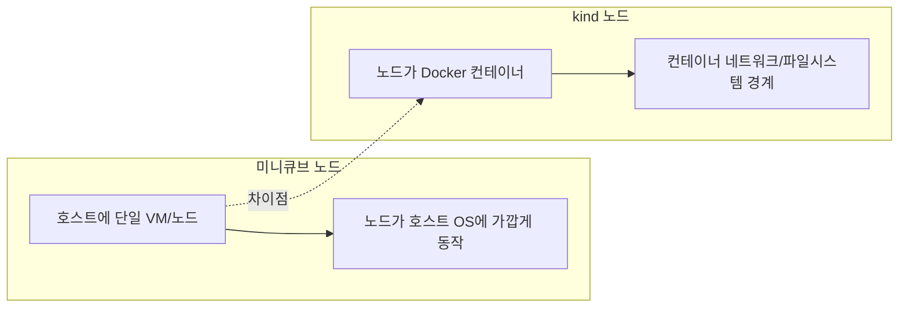

# 미니큐브 vs kind: 노드 비교

이 문서는 미니큐브와 kind의 노드 구조 차이를 플로우차트로 비교합니다.

## 차이점 설명

- 미니큐브는 보통 단일 VM/노드로 실행되어 호스트와의 경계가 상대적으로 단순합니다.
- kind는 노드가 Docker 컨테이너이므로 네트워크/파일시스템 경계가 더 뚜렷합니다.
- 결과적으로 kind는 포트 노출, 볼륨 경로, 디버깅 접근 방식이 컨테이너 환경 기준으로 동작합니다.

