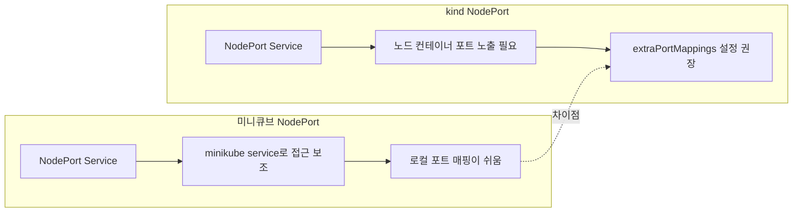

# 미니큐브 vs kind: NodePort 비교

이 문서는 NodePort 접근 방식의 차이를 비교합니다.

## 차이점 설명

- 미니큐브는 `minikube service`가 NodePort 접근을 쉽게 보조해줍니다.
- kind는 노드가 컨테이너라서 NodePort만으로는 호스트 접근이 어려울 수 있습니다.
- `extraPortMappings` 설정이나 포트포워딩을 함께 고려해야 합니다.

