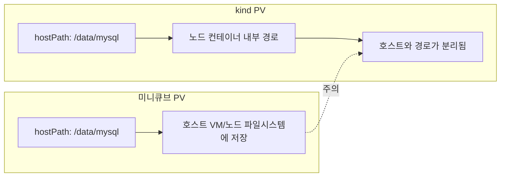
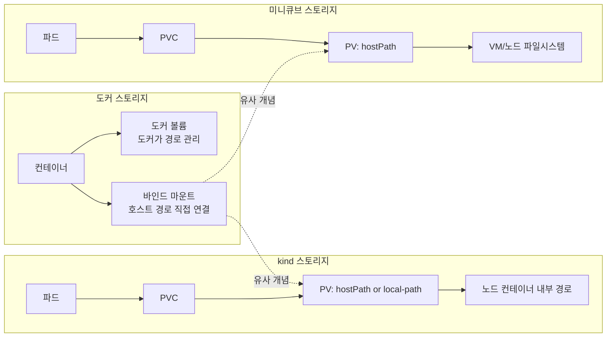

# 미니큐브 vs kind: PV 비교

이 문서는 PV(hostPath 중심)의 차이를 플로우차트로 비교합니다.

## 차이점 설명

- 미니큐브의 hostPath는 VM/노드 파일시스템에 직접 저장됩니다.
- kind의 hostPath는 노드 컨테이너 내부 경로이므로 호스트 경로와 분리됩니다.
- 데이터 보존이 중요하면 hostPath 대신 스토리지클래스나 명시적 볼륨 마운트를 고려해야 합니다.

## 스토리지 개념 정리

- 바인드 마운트는 호스트 경로를 컨테이너에 직접 연결하는 방식입니다.
- 볼륨 마운트는 도커가 관리하는 저장소를 컨테이너에 연결하는 방식입니다.
- hostPath는 쿠버네티스 노드 경로를 PV로 쓰는 방식입니다.
- local-path는 PVC를 노드 로컬 경로로 자동 바인딩하는 스토리지 클래스입니다.

## local-path vs hostPath 차이

- hostPath는 경로 지정과 보존을 사용자가 직접 관리해야 합니다.
- local-path는 자동 바인딩으로 운영이 단순하지만 노드 로컬에 묶입니다.

## 도커 vs kind vs 미니큐브 스토리지 흐름

