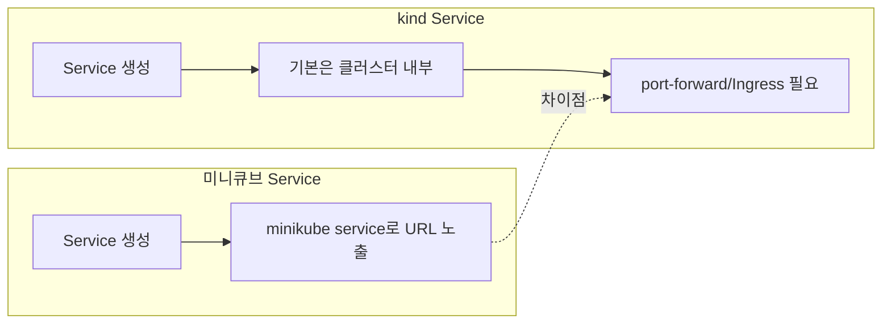

# 미니큐브 vs kind: Service 비교

이 문서는 Service 동작과 접근 흐름을 비교합니다.

## 차이점 설명

- 미니큐브는 `minikube service`로 로컬에서 바로 접근 가능한 URL을 제공합니다.
- kind는 기본적으로 클러스터 내부 접근만 가능해 포트포워딩이나 Ingress 구성이 필요합니다.
- 따라서 접속 경로를 문서화하고 공유할 때 노출 방식이 달라집니다.

